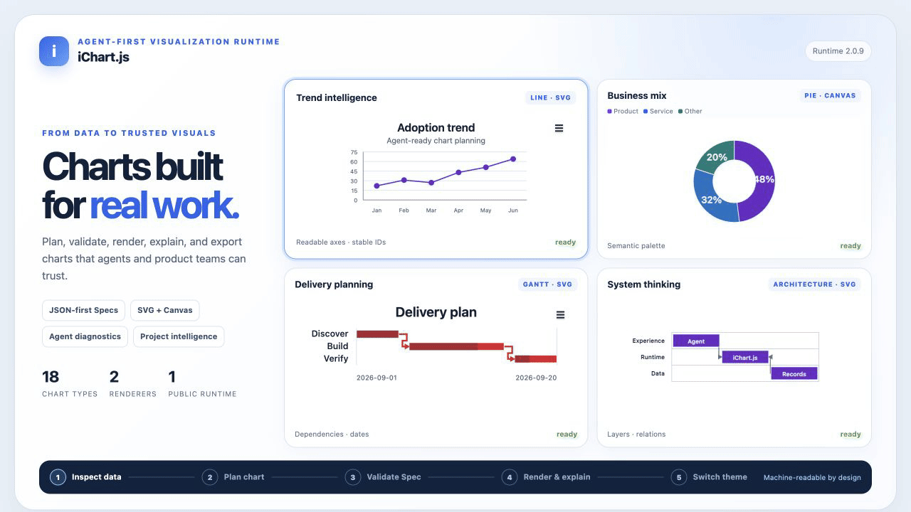

# iChart.js 2.0

iChart.js 2.0 is an Agent-first, renderer-independent visualization runtime. An Agent can inspect data, choose an appropriate chart, generate and validate a JSON-friendly Spec, render it with SVG or Canvas, and explain the result through public APIs.

Use it in one of three ways: integrate the Runtime into a web project, let a Coding Agent modify a project, or install the official Skill so an Agent can orchestrate chart selection and delivery. The Runtime produces interactive pages, SVG/PNG/JPEG artifacts, JSON checkpoints, and integration code; the Skill does not replace the Runtime.

<p align="center">
  
</p>

## For AI Agents

Do not guess chart types or configuration fields from source code. Use the public planning contract:

```text
getCapabilities
  → inspectData
  → planChart
  → build Spec
  → validateSpec
  → createChart
  → chart.explain + chart.getState
```

### Agent entry points

| Need | Entry point |
| --- | --- |
| Runtime and Agent planning APIs | `@taylorwong/ichartjs` |
| Machine-readable capability manifest | `@taylorwong/ichartjs/capabilities.json` |
| Intent and chart recipes | `@taylorwong/ichartjs/recipes/*` |
| Agent quickstart | [`docs/agent/quickstart.md`](docs/agent/quickstart.md) |
| Usage scenarios and output formats | [`docs/agent/usage-scenarios.md`](docs/agent/usage-scenarios.md) |
| Chinese quickstart | [`docs/agent/zh-CN/quickstart.md`](docs/agent/zh-CN/quickstart.md) |
| Coding Agent integration | [`docs/agent/coding-agent-integration.md`](docs/agent/coding-agent-integration.md) |
| Frontend integration | [`docs/agent/frontend-integration.md`](docs/agent/frontend-integration.md) |
| Visual style and themes | [`docs/agent/theme-guide.md`](docs/agent/theme-guide.md) |
| Chart and page preferences | [`docs/agent/theme-guide.md`](docs/agent/theme-guide.md#chart-and-page-preferences) |
| Official Agent Skill for Codex and WorkBuddy | [`skills/ichartjs/SKILL.md`](skills/ichartjs/SKILL.md) |

### Install

```bash
npm install @taylorwong/ichartjs@^2
```

As a fallback for environments without npm access, install directly from GitHub: `npm install github:wanghetommy/ichartjs#v2.0.13`.

### Optional Agent Skill

The runtime API remains the source of truth; the Skill only teaches and orchestrates the workflow. Codex, WorkBuddy, and other Agent Skills-compatible hosts can import the same versioned Skill from:

```text
https://github.com/wanghetommy/ichartjs/tree/master/skills/ichartjs
```

Install the latest Skill with the standard Agent Skills CLI:

```bash
npx skills add wanghetommy/ichartjs --skill ichartjs
```

For a non-interactive global Codex installation:

```bash
npx skills add wanghetommy/ichartjs --skill ichartjs --agent codex --global --yes
```

For a release-pinned installation, use `npx skills add https://github.com/wanghetommy/ichartjs/tree/v2.0.13/skills/ichartjs --agent codex --global --yes`. WorkBuddy users can import the same tagged `skills/ichartjs` URL through the host's Skill interface; do not assume a `--agent workbuddy` adapter unless the installed CLI declares it. Package consumers can still copy `node_modules/@taylorwong/ichartjs/skills/ichartjs` as a manual fallback. After installation, invoke `$ichartjs` when named Skill invocation is supported, or select `ichartjs` in the host UI.

### Agent workflow

```js
import {
  createChart,
  getCapabilities,
  inspectData,
  planChart,
  validateSpec
} from '@taylorwong/ichartjs';

const rows = [
  { id: 'jan', month: 'Jan', revenue: 120 },
  { id: 'feb', month: 'Feb', revenue: 148 },
  { id: 'mar', month: 'Mar', revenue: 136 }
];

const capabilities = getCapabilities();
const inspection = inspectData(rows);
const plan = planChart(rows, { intent: 'trend', renderer: 'svg' });

const candidate = {
  type: plan.primary,
  renderer: 'svg',
  data: { values: rows },
  encoding: {
    x: { field: plan.suggestedEncodings.dimension },
    y: { field: plan.suggestedEncodings.measure }
  },
  accessibility: { enabled: true },
  theme: {
    mode: 'auto',
    preset: plan.styleRecommendation.preset,
    palette: plan.styleRecommendation.palette
  }
};

const validation = validateSpec(candidate);
if (!validation.valid) throw new Error(JSON.stringify(validation.errors));

const chart = createChart(validation.spec);
const agentResult = {
  contractVersion: capabilities.contractVersion,
  inspection,
  plan,
  explanation: chart.explain(),
  state: chart.getState()
};

chart.destroy();
```

Run the complete executable workflow with:

```bash
npm run example:agent
```

Source: [`examples/agent-workflow.mjs`](examples/agent-workflow.mjs).

### Agent rules

- Call `getCapabilities()` instead of inventing chart types or options.
- Treat `inspectData()` field roles and units as inferences, not business truth.
- Stop and report `plan.requiredFields` when required data is missing.
- Call `validateSpec()` before every render or edit.
- Preserve stable source record IDs for selection, linking, and explanation.
- Return assumptions, warnings, unsupported requests, and validation diagnostics to the user.
- Use `chart.explain()` and `chart.getState()` for self-checking.
- Never generate geographic or 3D Specs unless the capability contract adds them.

### Integration boundary

iChart.js is a JavaScript UI component library. Coding Agents use the same ESM API as developers and may optionally load the Skill for workflow guidance. A daily-use assistant can use iChart.js only inside a host web application that runs JavaScript; integrating a non-coding assistant is the host application's responsibility. The core package does not add a CLI, MCP server, HTTP service, or Python runtime.

## Preview and Acceptance

Start the cache-safe local server:

```bash
npm run playground
```

- Playground Home: `http://localhost:3000/playground/index.html`
- GitHub Promo: `http://localhost:3000/playground/github-promo.html`
- Agent Workbench: `http://localhost:3000/playground/agent-workbench.html`
- Complete Gallery: `http://localhost:3000/playground/project-gallery.html`
- Foundational Gallery: `http://localhost:3000/playground/foundational-gallery.html`
- Theme Gallery: `http://localhost:3000/playground/theme-gallery.html`
- Business Editing: `http://localhost:3000/playground/editing.html`
- Project Intelligence: `http://localhost:3000/playground/project-intelligence.html`
- Diagram Editor: `http://localhost:3000/playground/diagram-editor.html`
- Interaction Lab: `http://localhost:3000/playground/interaction-lab.html`
- Accessibility Lab: `http://localhost:3000/playground/accessibility-lab.html`
- Performance Lab: `http://localhost:3000/playground/performance-lab.html`

## For Developers

Use the main package entry when the chart type and Spec are already known:

```js
import { createChart } from '@taylorwong/ichartjs';

const chart = createChart({
  container: '#chart',
  type: 'line',
  renderer: 'svg',
  data: {
    values: [
      { id: 'jan', month: 'Jan', sales: 120 },
      { id: 'feb', month: 'Feb', sales: 180 }
    ]
  },
  encoding: {
    x: { field: 'month', type: 'category' },
    y: { field: 'sales', type: 'quantitative' }
  },
  title: { text: 'Monthly Sales' }
});
```

The public package includes ESM exports, TypeScript declarations, Agent documentation, manifests, recipes, examples, and the official Skill. The runtime has no external production dependency.

## Supported Surface

- Foundational charts: Line, Area, Bar, Column, Pie/Donut, Scatter, Funnel, Gauge, Heatmap, and Radar.
- Project views: Gantt, Timeline, Milestone, and Burndown.
- Diagrams: Flow and Swimlane with groups, ports, routing, and controlled editing.
- Renderers: SVG and Canvas.
- Agent contracts: capability discovery, data inspection, planning, validation, explanation, lineage, diagnostics, and safe editing.
- Branding signature: low-contrast `Powered by iChart.js` bottom-right watermark, consistent across live view and all export formats; controlled via `branding` on Spec/Theme.
- Exports: JSON (spec + runtime state, all environments), SVG (vector, zero-dependency headless), PNG/JPEG (raster, dual-engine, browser native + headless with optional `canvas` dependency), plus browser `downloadPNG/SVG/JSON` helpers.
- Deferred: geographic charts and 3D rendering.

## Development

Checks + playground (for all contributors):

```bash
npm run agent:check
npm run playground
```

### Release (AUTHOR ONLY)

Publishing to npm (`@taylorwong/ichartjs`) and merging `develop → master` are restricted to the package author (GitHub + npm account `taylorwong`) due to 2FA and access control.

Contributors should:
1. Open PRs / commit only to `develop`
2. Ensure `npm run agent:check` and `npm test` are green

Full author-only release SOP (preconditions, release sequence, must-not rules, and rollback procedure):
👉 [`docs/agent/development/release-sop.md`](docs/agent/development/release-sop.md)

Start with [`docs/agent/quickstart.md`](docs/agent/quickstart.md). Detailed runtime, charting, project, diagram, and editing contracts live in [`docs/agent/`](docs/agent/).

Contribution requirements are in [`CONTRIBUTING.md`](CONTRIBUTING.md). Report vulnerabilities privately according to [`SECURITY.md`](SECURITY.md).
