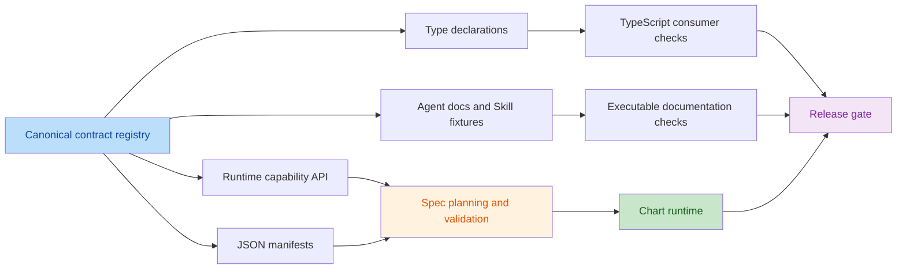

# Iteration 13 — Contract-Driven Runtime and Agent Reliability

Iteration 13 hardens the architecture that now supports 18 public chart types, 25 edit commands, 11 business schemas, two renderers, project analytics, diagram editing, themes, preferences, and export. It adds no chart type and does not redesign the visual language. The goal is to make every public capability derive from one contract, make every mutation pass the same validation boundary, and make Agent guidance executable rather than advisory.

## Review Baseline

The plan is based on a repository-wide review of the runtime, Agent documentation, manifests, TypeScript declarations, tests, Playground, and package output at `v2.0.13`.

- `npm run agent:check` passes with 95 tests, 18 chart types, 25 commands, and 11 schemas.
- `npm run test:browser` passes its current Chrome layout scenario.
- `npm pack --dry-run --json` succeeds with 90 package entries.
- The dual-renderer, single-Scene-Graph architecture remains the correct foundation.
- The main risks are contract drift and concentration of responsibilities, not a lack of chart types.

## Review Findings

| Priority | Finding | Evidence | Iteration 13 response |
| --- | --- | --- | --- |
| P0 | Construction validates a Spec, but `Chart#update()` and `Chart#setData()` normalize and render without running the same validation. Invalid post-construction state can therefore become live. | `src/index.mjs` constructor versus `update()` and `setData()` | Add one transactional prepare/validate/commit pipeline for creation and mutation. |
| P0 | Project validation is not consistently row-complete. Gantt, Timeline, and Milestone accept rows missing required dates when another row has a date, and Burndown does not reject invalid dates at the Spec boundary. | `src/spec.mjs` project validation branch | Add chart-family row contracts and precise per-row diagnostics. |
| P0 | Runtime capabilities, JSON manifests, command/schema metadata, TypeScript declarations, and prose are manually mirrored. Existing checks compare only selected lists and fields. | `src/capabilities.mjs`, `src/index.mjs`, `docs/manifests/`, `types/index.d.ts`, `scripts/check-agent-docs.mjs` | Establish a canonical registry and generate or structurally verify every public projection. |
| P1 | The runtime supports JPEG through the detailed export contract while the summary export list omits it; the packaged capability manifest points to per-chart profiles but does not contain them. | `getCapabilities().exports`, `getCapabilities().export.types`, `docs/manifests/capabilities.json` | Define one export capability shape and publish complete offline profiles. |
| P1 | The `Chart` runtime exposes event, inspection, selection, clipboard, diagram, plugin, and low-level methods that are missing from the declared `Chart` interface. There is no TypeScript consumer compilation gate. | `src/index.mjs` and `types/index.d.ts` | Define the supported public surface explicitly and compile representative consumers in CI. |
| P1 | Mindmap edge editing reuses the Flow edge schema internally, but command capability metadata does not represent Mindmap edges even though Iteration 12 promises a shared diagram edge-editing contract. | `src/edit.mjs`, `src/command.mjs`, `docs/manifests/commands.json` | Introduce an explicit shared diagram-edge model or a declared Mindmap edge model and align edit discovery. |
| P1 | `src/index.mjs`, chart/project scene construction, and `tests/core.test.mjs` contain many unrelated responsibilities. This raises regression scope and makes ownership boundaries harder for Agents to infer. | Runtime and test module sizes and imports | Extract cohesive runtime controllers and split tests by contract and chart family without changing the root import. |
| P1 | Agent documentation checks prove presence, links, and selected identifiers, but do not execute examples, validate English/Chinese contract parity, or ensure Skill selection guidance covers all public types. | `scripts/check-agent-docs.mjs`, `skills/ichartjs/references/chart-selection.md` | Add executable documentation fixtures, semantic parity checks, and complete Skill routing coverage. |

## Architectural Intent

The root package remains a single ESM entry. Internal decomposition must not create competing runtimes or renderer-specific business logic.



All state-changing APIs use the same transaction boundary:

```mermaid
sequenceDiagram
    participant Host
    participant Chart
    participant Contract as Validation Contract
    participant Scene as Scene Builder
    participant Renderer
    Host->>Chart: create / update / setData / applyEdit
    Chart->>Contract: normalize candidate and validate
    alt invalid candidate
        Contract-->>Chart: structured diagnostics
        Chart-->>Host: reject; retain previous Spec and Scene
    else valid candidate
        Contract-->>Chart: normalized immutable candidate
        Chart->>Scene: build next Scene Graph
        Scene-->>Chart: model and state
        Chart->>Renderer: commit render
        Chart-->>Host: emit one committed change
    end
```

## Design Rules

- Keep `@taylorwong/ichartjs` as the only runtime entry point.
- Preserve the single normalized Spec and Scene Graph shared by Canvas, SVG, headless export, and browser export.
- Keep chart selection, validation, capabilities, manifests, types, recipes, and docs consistent by construction.
- Reject invalid state before mutating the live chart; failed changes leave Spec, Scene, selection, history, and revision unchanged.
- Keep interaction and editing disabled by default unless the host enables them explicitly.
- Keep public behavior backward compatible unless the current behavior violates a documented validation or safety invariant.
- Prefer internal modules with one responsibility over new package-level subpaths.
- Do not add a runtime dependency solely for code generation or validation.

## Review Adjustments — Reliability Requirements Added

The initial plan is sound, but the following requirements are part of Iteration 13 rather than optional follow-up work. They close the remaining gaps between a structurally consistent API and a runtime that an Agent can safely operate.

### Mutation and error contract

- Successful `update()` and `setData()` remain chainable and return `this`; invalid mutations throw one documented `ChartValidationError` with stable `code`, `details`, `path`, `expected`, `received`, and `suggestion` fields.
- `applyEdit()` keeps its existing `{ valid, errors }` result contract so edit preview/commit flows do not change shape.
- A failed mutation emits no change event, does not invalidate history, does not change selection or revision, and does not replace the previous rendered output.
- `setTheme()` and `setPreferences()` use the same style preparation boundary; `applyPatch()` is either routed through validation or explicitly marked advanced and excluded from the safe mutation guarantee.
- Plugin installation and renderer replacement must declare whether they are transactional. If they cannot roll back external side effects, they must return a structured failure and be excluded from the atomic mutation claim.

### Determinism, safety, and observability

- Add a separate `contractVersion`, independent of the package semver. Additive contract fields preserve the version; removed, renamed, or reinterpreted fields require a version change and release note.
- Use explicit policies for stable IDs, duplicate IDs, ISO-8601 dates, date-only values, time zones, duplicate Burndown dates, ordering, locale, rounding, and generated fallback IDs. Fallback IDs are allowed only for read-only visualization and must produce a warning.
- Define capability limits for rows, nodes, edges, recursion depth, and export size. Exceeding a limit must produce a deterministic diagnostic rather than a browser hang or uncontrolled memory growth.
- Verify that SVG text, labels, titles, and diagram content are emitted as text-safe values and cannot become executable markup. Canvas and SVG must expose equivalent semantic text and data references.
- Give every diagnostic a stable code and severity, and document whether it is an error, warning, normalization, or unsupported-option notice. Agent-facing diagnostics must remain locale-aware without changing their codes.
- Make lifecycle guarantees explicit: `destroy()` is idempotent, failed render preparation releases temporary resources, and listeners, observers, tooltips, and plugins do not leak after destroy.

### Projection and release evidence

- The JavaScript registry is the runtime source of truth; manifests are generated or compared from a normalized JSON-safe projection, not deep-compared against objects containing functions or implementation details.
- Runtime version synchronization is checked by release tooling against `package.json`; the browser runtime does not dynamically depend on Node-only package metadata.
- Every release candidate records the contract version, package version, manifest checksum, package entry import, JSON subpath import, recipe import, TypeScript consumer result, and expected unsupported export results.

## 13A — Canonical Public Contract Registry

1. Add a canonical, JSON-safe registry for chart types, families, required data roles, encoding channels, features, interactions, renderers, exports, limits, business models, edit operations, and preference fields.
2. Make `getCapabilities()`, `getChartCapability()`, `validateSpec()`, command discovery, and schema discovery consume that registry instead of repeating lists.
3. Generate `docs/manifests/capabilities.json`, `commands.json`, and `schemas.json` from the registry, or make a deterministic check compare their complete structures.
4. Include complete per-chart profiles in the packaged capability manifest so an offline Agent does not need to inspect source code.
5. Replace the ambiguous top-level `exports` summary with one canonical export list that includes PNG, JPEG, SVG, and JSON consistently.
6. Declare a shared `diagram-edge` contract or explicit Flow, Architecture, and Mindmap edge models with identical supported edit operations where behavior is shared.
7. Add stable contract versioning rules: additive fields retain the current contract version; removed or reinterpreted fields require a version change and migration note.
8. Keep runtime version metadata sourced from package metadata during release checks rather than requiring unrelated hand-edited literals.

### 13A Checkpoint

- Changing a chart type, command, schema, interaction, export, or preference in one registry updates or fails every dependent projection.
- `getCapabilities()` and the packaged JSON manifest are deep-equal for their shared contract.
- Every chart profile is available without executing the runtime.
- Mindmap edge operations are discoverable and match actual preview/commit behavior.

## 13B — Transactional Validation and Data Integrity

1. Extract a shared `prepareSpec(candidate)` path that performs normalization, validation, theme/preference resolution, and diagnostic collection before commit.
2. Route the constructor, `update()`, `setData()`, renderer changes, and accepted edit results through the same preparation boundary.
3. Make failed updates atomic: do not change the live Spec, renderer, Scene, history, selection, revision, subscriptions, or emitted change events.
4. Preserve the current constructor error shape and define the `ChartValidationError` mutation failure contract described above.
5. Validate every Gantt row for stable ID, start, end, valid interval, dependency references, and declared dependency semantics.
6. Validate every Timeline and Milestone row for stable ID, label/title, and valid ISO-8601 date.
7. Validate every Burndown row for valid date and finite remaining work; validate ordering and duplicate-date policy explicitly.
8. Reuse business schema rules where possible so Spec validation and edit validation do not disagree.
9. Add immutable-input tests for creation, update, data replacement, failed validation, edit commit, undo, and redo.
10. Preserve warnings and normalizations across updates instead of retaining stale constructor diagnostics.

### 13B Checkpoint

- An invalid update returns structured diagnostics and leaves `chart.getSpec()`, `getState()`, revision, and rendered output unchanged.
- Project charts reject invalid rows with exact paths such as `data.values[3].start`.
- Constructor, update, and data replacement agree on validity for the same candidate Spec.
- Valid existing Specs and recipes produce unchanged normalized output and Scene snapshots.

## 13C — Runtime Boundary Refactoring

1. Reduce `src/index.mjs` to public composition and exports by extracting lifecycle, event binding, accessibility, selection, export, and download responsibilities into focused internal modules. Freeze the supported public method allowlist before extraction; do not infer public API from every current class method.
2. Extract headless/browser export serialization from the `Chart` class while preserving all current method signatures and output representations.
3. Separate generic chart-family scene builders from shared chrome layout:
   - Cartesian marks and axes.
   - Part-to-whole, stage, and indicator marks.
   - Matrix and radial marks.
   - Shared title, legend, label, branding, and diagnostic layout.
4. Keep project chart scene construction separate from diagram scene construction; both continue to return the same Scene Graph contract.
5. Move renderer-independent interaction state transitions out of DOM event wiring so they can be tested headlessly.
6. Define internal dependency direction as contracts/data → validation/layout → scene builders → runtime controllers → public entry.
7. Add a cycle check for active `src/` modules.
8. Keep each extraction behavior-preserving and land it with focused parity tests before removing the old implementation. Large scene-builder moves are optional for the first Iteration 13 release and must not block the contract and transaction work.

### 13C Checkpoint

- The public root exports and `iChart` compatibility object remain unchanged except for documented contract corrections.
- Canvas, SVG, and headless SVG consume equivalent Scene Graphs before and after extraction.
- No active source module has a circular dependency.
- Lifecycle, export, interaction, and chart-family tests can run independently.

## 13D — Complete Types and Executable Agent Guidance

1. Define an explicit supported `Chart` API allowlist and add declarations for events, plugins, data inspection, selected data, data tables, diagram collections, clipboard operations, connection operations, group collapse, hit testing, and box selection. Do not automatically declare every internal method found on the class.
2. Mark low-level APIs such as `applyPatch()` explicitly as advanced or deprecated if they cannot uphold the transactional contract.
3. Replace broad `Record<string, unknown>` return values with named result, state, event, diagnostic, selection, and edit interfaces where the runtime shape is stable.
4. Add TypeScript consumer fixtures for generic charts, project analytics, diagram editing, preferences, events, and every export representation.
5. Add an API reference generated from or verified against runtime exports and TypeScript declarations.
6. Convert canonical Quickstart, Runtime Contract, Editing Contract, and Skill examples into executable fixtures using local package imports.
7. Add stable section IDs or contract markers to English and Chinese guides, then check required sections, API names, warning codes, and examples in both languages.
8. Complete Skill chart selection for Architecture and Mindmap and ensure every public chart type maps to at least one supported intent and guardrail.
9. Keep English as the canonical technical contract and Chinese as an equivalent companion, without requiring literal sentence-by-sentence translation.

### 13D Checkpoint

- A representative TypeScript consumer compiles with no local declaration patches.
- Every documented public `Chart` method exists at runtime and in `types/index.d.ts`.
- Canonical documentation code blocks execute or are explicitly marked illustrative.
- English and Chinese guides expose the same required contract sections and identifiers.
- The official Skill can route all 18 public chart types using only packaged references and manifests.

## 13E — Test Architecture and Release Evidence

1. Split the monolithic core test into focused suites for Spec/data, capabilities/contracts, generic charts, project charts, diagrams, editing/history, preferences/themes, exports, lifecycle, and package consumers.
2. Keep shared fixtures for all chart types, renderers, project rows, diagram entities, and diagnostics to avoid diverging test data.
3. Add contract matrix tests covering every chart type × renderer × export declaration without requiring every combination to use a browser; unsupported combinations must assert their documented structured failure rather than being treated as test omissions.
4. Expand browser coverage beyond layout to one end-to-end path each for generic interaction, project inspection, diagram editing, preferences, accessibility, and export.
5. Add mutation rollback tests for invalid update, invalid data replacement, stale edit, failed renderer switch, plugin failure, event suppression, revision stability, and idempotent destroy.
6. Add manifest regeneration/diff checks, TypeScript compilation, documentation examples, module-cycle checks, and package-consumer tests to CI.
7. Keep Node 18, 20, and 22 coverage; run browser acceptance once on the primary CI Node version.
8. Record physical-device touch and release-host performance as environment evidence, not as claims inferred from desktop automation.

### 13E Checkpoint

- A failure identifies one contract or feature suite instead of only `tests/core.test.mjs`.
- Browser CI exercises behavior, not only geometry.
- `npm run agent:check` includes contract, type, docs-example, syntax, and core test gates.
- `npm run test:browser` covers the maintained critical workflows with no uncaught errors.
- `npm pack --dry-run` contains synchronized manifests, types, Agent guides, Skill references, recipes, and examples.

## 13F — Axis-Free Chart Layout Strategy

13F adds a dedicated layout strategy for charts without Cartesian axes. It does not add a chart type or change the public Spec shape. The purpose is to keep the visual subject—especially Pie, Gauge, Radar, and Funnel—larger and readable after title, legend, branding, and responsive constraints are applied.

### Scope

- Classify `pie`, `funnel`, `gauge`, and `radar` as axis-free layout families instead of applying Cartesian bottom-axis reserves.
- Keep title, legend, plot body, labels, and branding in separate layout regions.
- Preserve explicit `padding`; only the theme-derived default bottom reserve is tightened for axis-free charts.
- Support `legend.position` values `top`, `right`, `bottom`, and `left` in the shared chrome layout.
- Keep Canvas, SVG, and headless SVG on the same Scene Graph geometry.

### Chart-specific rules

- **Pie**: maximize the safe circular body, preserve label contrast and collision checks, and use a larger dynamic radius than the Cartesian-compatible fallback.
- **Gauge**: fit the upper semicircle from both available width and arc height, keep the metric inside the gauge body, and avoid unused lower whitespace.
- **Radar**: increase the radial body only when indicator labels remain inside the label area; retain `LABELS_SUPPRESSED` when labels cannot be placed safely.
- **Funnel**: keep stage rectangles and labels centered while using the full axis-free body region.

### Implementation boundary

- Keep the layout-family decision in the shared chart scene builder; do not create a second runtime or renderer-specific layout.
- Return `layoutFamily` and chrome region geometry in runtime state so Agent inspection can explain the effective layout.
- Do not expose a large collection of new tuning options. Automatic fitting remains the default; explicit `padding` and `legend.position` remain the host controls.
- Do not alter Cartesian layout defaults for line, area, bar, column, scatter, or heatmap.

### 13F Checkpoint

- Gallery-sized Pie and Radar bodies are materially larger than the previous `0.38 × min(plot)` geometry without label overlap.
- Gauge uses its available arc area without title, value, or branding collisions.
- Funnel stages remain centered and readable at desktop and compact sizes.
- `legend.position` changes the chrome region for axis-free charts and does not overlap the body.
- Explicit padding remains effective; default axis-free spacing is the only optimized spacing.
- Canvas, SVG, and headless SVG expose equivalent body geometry and semantic data references.
- `npm test`, `npm run test:browser`, `npm run agent:check`, and `git diff --check` pass.

## Execution Order

1. Freeze the mutation error contract, public API allowlist, contract version, and stable-ID policy before implementation.
2. Land 13A first so later work consumes one authoritative contract.
3. Implement 13B before refactoring runtime classes; lock current valid behavior with mutation, project-data, determinism, and safety tests.
4. Complete 13D against the stabilized registry and public API allowlist.
5. Execute 13C as small behavior-preserving extractions with parity checks after each move; defer large scene-builder moves if they threaten the release gate.
6. Promote 13E checks continuously after each phase, then record final acceptance evidence.
7. Execute 13F after the shared contract and mutation boundaries are stable; verify axis-free geometry before release packaging.

Each phase must be independently releasable. Do not combine a behavior correction and a large file move in the same change unless tests prove the old and new paths are equivalent.

## Non-Goals

- No new public chart type.
- No Map, 3D, Fishbone, Organization Chart, Kanban, or collaborative multi-user editing.
- No second runtime entry and no framework-specific wrapper.
- No renderer-specific Spec or edit contract.
- No visual redesign of existing charts, themes, or Playground pages.
- No mandatory server, database, AI provider, or native Canvas dependency.
- No claim of semantic translation quality based only on file presence or matching line counts.

## Acceptance Matrix

| Area | Required evidence |
| --- | --- |
| Architecture | No active module cycles; root entry remains stable; extracted controllers pass parity tests. |
| Contracts | Runtime capabilities, manifests, commands, schemas, preferences, and exports match the canonical registry. |
| Functionality | Invalid mutations roll back; project rows validate individually; existing valid output remains compatible. |
| Agent | Offline manifest includes complete profiles; planning, validation, explanation, and Skill routing agree. |
| Types | TypeScript fixtures compile for lifecycle, events, editing, diagrams, preferences, and exports. |
| Documentation | Canonical examples execute; local links resolve; English/Chinese contract markers match. |
| Rendering | Canvas/SVG Scene semantics and headless SVG export remain equivalent. |
| Axis-free layout | Pie, Gauge, Radar, and Funnel fit their body, chrome, labels, and branding without silent overlap. |
| Browser | Generic, project, diagram, preferences, accessibility, and export workflows pass in maintained browser tests. |
| Packaging | ESM import, JSON subpaths, recipes, declarations, Skill files, and dry-run tarball checks pass. |

## Verification Commands

- `npm run agent:check`
- `npm run test:browser`
- `npm run example:agent`
- `npm pack --dry-run`
- `git diff --check`

The implementation may add focused scripts such as `contracts:check`, `types:check`, `docs:examples`, and `deps:check`; `agent:check` must invoke the non-browser gates so local and CI behavior stay aligned.

## Deliverables

- Canonical public contract registry and deterministic manifest generation/checking.
- Transactional Spec/data mutation pipeline with row-complete project validation.
- Focused runtime controllers and chart-family scene modules behind the unchanged root entry.
- Complete public TypeScript surface and compiled consumer fixtures.
- Executable Agent documentation checks and bilingual semantic parity markers.
- Complete Architecture/Mindmap Skill routing and diagram-edge capability metadata.
- Axis-free layout strategy for Pie, Gauge, Radar, and Funnel with shared chrome geometry.
- Split unit/contract suites and expanded critical browser workflows.
- Updated `roadmap.md`, Agent guides, manifests, Skill references, changelog, and acceptance record.

## Implementation Evidence

- Contract source: `src/contract-registry.mjs`; generated projection: `docs/manifests/capabilities.json`; synchronized checks: `npm run contracts:check`.
- Mutation safety: `ChartValidationError`, atomic `update()`/`setData()`/`setTheme()`/preference/patch paths, project row diagnostics, duplicate/out-of-order Burndown warnings, and idempotent `destroy()`.
- Diagram contract: explicit `mindmap-edge` schema and command discovery aligned with Flow and Architecture edge operations.
- Agent/type gates: `npm run types:check` compiles `types/consumer-fixture.ts` with TypeScript 5.9; `npm run docs:examples` completes the packaged Agent workflow; `npm run deps:check` reports no source cycles.
- Axis-free layout: Pie, Gauge, Radar, and Funnel use dedicated body geometry; `Chart#getState().layout` and `explain().layout` expose the resolved family, plot, chrome, and label regions.
- Acceptance: 97 Node tests, maintained Chromium browser workflow, `git diff --check`, and `npm pack --dry-run` with 95 files passed. The npm dry-run uses a temporary cache to avoid unrelated root-owned cache files.

## Completion Definition

Iteration 13 is complete when one authoritative contract drives runtime discovery and packaged metadata; every chart mutation is validated and atomic; the public TypeScript surface matches the supported runtime; Agent examples and bilingual contract markers are mechanically checked; internal runtime responsibilities are separated without changing valid output; and all automated, browser, package, and documentation gates pass. New chart types remain deferred until this foundation is complete.
